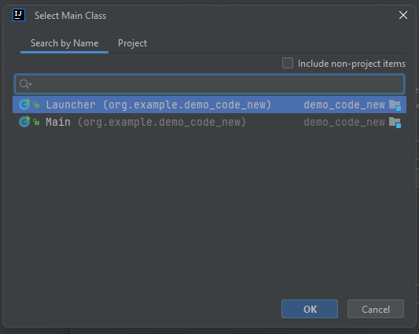

<h1>File structure</h1>

All code logic is created inside 
src/main/java/com/fierydragons/game

All code assets and scenes are inside
src/main/resources

All the images located inside the ReadMePictures are for the readme

All relevant documents such as the Sprint 3 Reflection and UML can be found in their respective folders inside the Documents folder

Artefacts are inside out\artifacts

<h1>Video details</h1>
The video will be in mp4 which could be run on any player for example: windows media legacy player

OR

through VLC

Download here

https://www.videolan.org/vlc/

<h1>This project was constructed using the following software:</h1>

- IntelliJ

- OpenJDK 22

  - OpenJDK 17.0.11 with hsdis ( if JDK 22 cannot ) 
  - OpenJDK 21 for MAC 

- Windows Operating System, Mac Operating System

hardware:

1) 64 bit architecture 

<h1>It is detrimental that you use IntelliJ as well</h1>

<h1>To construct the project artefact using IntelliJ</h1>
1) click FILE

2) click PROJECT STRUCTURE 

3) click artefacts and press the + button

4) click JAR and click "From modules ..."

5) you will see this screen next

6) click on the folder icon in the text box for the "Main Class:" and click launcher and click OK

7) build the artefact

8) click "Build Artifacts..." and click build

9) You will see this in the out folder

10) to run the jar file, right click on the "file.jar", click run

<h1>Potential issues</h1>

If this issue appeared in the terminal

The "red warning" is normal, don't worry about it

HOWEVER, the issue found "Loading hsdis library failed" is a serious issue which is a result of the jdk you are using

<h2>Solution for the "Loading hsdis library failed"</h2>

2) click PROJECT STRUCTURE

3) click Build, click the drop down for the text field "SDK: ", click "Download JDK... "

4) select version 17, click Download

5) after downloading, go to the address

<b>If the download for IntelliJ was using the default directories the jdk can be found here</b>

C:\Users\[ your computer user name ]\.jdk

for example:
C:\Users\Bernard\.jdks

6) you may see something like this

7) click cornetto-17.0.11, click bin, click server

Try to find the hsdis-amd64.dll, as shown in the picture
NOTE, this is for a device with IntelliJ x64 installed 

<h3>If hsdis-amd64,dll does not exist</h3>

1) go to this link

https://chriswhocodes.com/hsdis/

click the blue link for windows for 64 bits if your device is 64 bits and 32 bits if 32 bits architecture

2) go to the downloads folder / where this file is downloaded

3) move the file to the folder of this address similar to what you did to check for hsdis-amd64.dll

C:\Users\[ your computer user name ]\.jdk

4) now try running it again 

<h1>Trying to use the .jar without IntelliJ ( experimental ) </h1>

This method of running the .jar file is mentioned to be experimental because, this was tested with the developer's second laptop
but it could not run. However, this method could run with the developer's main laptop where this project was created in

<b>Possible causes</b>
1) jdk version
2) JRE version

The java in the main developer's laptop, go to this link

https://www.java.com/en/download/manual.jsp

1) click the Windows download for offline

the file that will download will have this name

2) run the executable 

3) run the .jar artifact 

<h1>References</h1>

As indicated in the code some portions mainly with displaying UI were adapted from ChatGPT
The pictures used in the game were sourced from

https://boardgamegeek.com/boardgame/23658/fiery-dragons.

https://www.rawpixel.com/

https://www.freepik.com/

https://www.cleanpng.com/

All rights are reserved to the respective owners.

